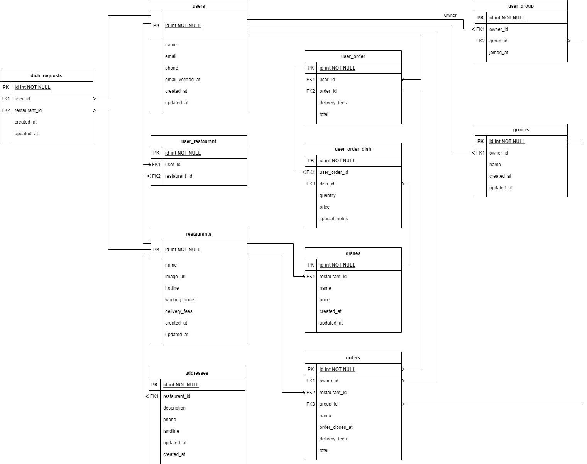

# Gathera

Gathera is an application to support group food ordering without carrying the burden of calculating tax and delviery fees and each user separate fee.

You can find phase one ERD in the image below

## Contributing
Pull requests are welcome. For major changes, please open an issue first to discuss what you would like to change.